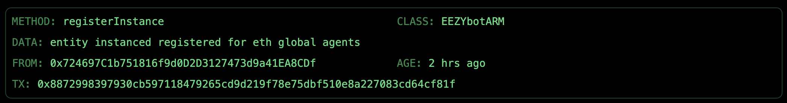

# Sepiol Storage

## git for robotic agents

New embodiments can be registered, automatically converted into digital twins for simulation and training, and instances of specific embodiments can be added to the system, their virtual and physical representations paired. 


Traditionally, robotic agents in simulated environments and robotic agents in physical robots exist in two separate constructs. Sepiol Storage unifies the two. Not only does this provide a decentralized repository that creates a common representation between virtual and physical robotics agents, but it is also the first decentralized repository able to train robots across a decentralized system and capture affordance (functional) and safety attestations. 

This system of identifying embodiments and instances of robots is the foundation of a long-term solution that can be used to track robotic agents, store training instances over time, distribute training data, add them to a swarm or DAO, and attest or expand funcionality across a distributed system. 


## How it Works

Robot embodiments are registered on the Arbitrum chain. At that point, a digital twin is generated using Roboforge. 

Users can register instances of embodiments. These will have their unique transaction hash added to the physical embodiment before sending the model to a 3D printer, connecting the virtual and physical representations. 


## 3D Pipelines

The 3D pipelines handle the conversion between different 3D file formats and the creation of digital twins with blockchain-based identification. These pipelines enable the connection between physical robot embodiments and their digital representations on the blockchain.

### Pipeline Components

#### 1. STL to OBJ Conversion
`stl_to_obj.py` handles the conversion of STL files (common 3D printing format) to OBJ format (used for digital twin generation).

```bash
python stl_to_obj.py
```

#### 2. CAD to URDF Conversion
`cad_to_urdf.py` generates URDF (Unified Robot Description Format) files from Onshape CAD assemblies for robot simulation.

```bash
python cad_to_urdf.py <cad_url> --name <robot_name> --output <output_file>
```

#### 3. Physical Identification System
`identify_3dprint.py` adds blockchain transaction hashes as raised text to 3D models before printing.

```bash
python identify_3dprint.py \
    --input ./obj/EBA_01.00.010_basement.obj \
    --output ./id/EBA_01.00.010_basement.obj \
    --text <transaction_hash> \
    --depth 5.0 --scale 0.5
```

### Directory Structure

```
3D_pipelines/
├── stl/           # Input STL files
├── obj/           # Converted OBJ files
├── id/            # Models with added identifiers
└── scripts
    ├── stl_to_obj.py
    ├── cad_to_urdf.py
    └── identify_3dprint.py
```

### Workflow

1. **Format Conversion**
   - Convert STL files to OBJ format using `stl_to_obj.py`
   - Process CAD designs into URDF files using `cad_to_urdf.py`

2. **Digital Twin Generation**
   - Use the URDF files to create digital twins
   - Register the embodiment on Arbitrum blockchain

3. **Physical Identification**
   - Take transaction hash from blockchain registration
   - Add hash to 3D model using `identify_3dprint.py`
   - 3D print the marked model




### Dependencies

```text
trimesh
pyvista
vtk
numpy
onshape-robotics-toolkit
```

Install dependencies using:
```bash
pip install -r requirements.txt
```


## App

The Robot Embodiment Registry is a decentralized application (dApp) for managing and verifying robot identities on the blockchain. It runs on the Arbitrum Sepolia testnet and allows users to register robot classes and instances with secure, verifiable identities.

### Live Demo

The application is deployed and can be accessed at: https://sepiol-storage.vercel.app/

### Features

- Register new robot embodiment classes on the blockchain
- Create robot instances under existing classes
- View complete transaction history for all registrations
- Real-time MetaMask integration for secure blockchain transactions

### Local Development

To run the application locally:

1. Clone the repository
2. Install dependencies:
```bash
npm install
```

3. Copy the example environment file and configure your environment:
```bash
cp .env.example .env
```

4. Start the development server:
```bash
npm run dev
```

5. Open [http://localhost:3000](http://localhost:3000) with your browser to see the result.

### Technology Stack

- **Frontend**: Next.js 14, React 18
- **Styling**: Tailwind CSS
- **Web3**: ethers.js
- **State Management**: React Query with tRPC
- **Database**: PostgreSQL with Prisma
- **UI Components**: shadcn/ui, Lucide React icons
- **Development Tools**: TypeScript, ESLint, Prettier

### Smart Contract

The application interacts with a smart contract deployed at:
`0x9E87c600d5D2922bE155B2D721DfDf792Ca3034d` on Arbitrum Sepolia testnet.

### Project Structure

- `/src/app`: Main application pages and API routes
- `/src/components`: Reusable React components
- `/src/lib`: Utility functions and contract configurations
- `/src/server`: Backend API and database configuration
- `/src/styles`: Global styles and Tailwind configuration
- `/src/trpc`: tRPC setup and configuration


## Genesis Simulation


*[Registered and Generated Eezybot model for simulation](https://github.com/ltejedor/sepiol_storage/tree/main/genesis_simulation/genesis/assets/urdf/eezybot)*


This project uses the [Genesis Simulator](https://github.com/Genesis-Embodied-AI/Genesis) for robot simulation and testing. Genesis provides a high-performance, physics-accurate environment for testing robot embodiments.

### Setup and Installation

1. First, install Genesis following their installation guide:
```bash
# Install PyTorch first (required)
pip install torch

# Install Genesis
pip install genesis-world  # Requires Python >=3.9
```

2. Clone this repository and set up the simulation environment:
```bash
git clone https://github.com/ltejedor/sepiol_storage.git
cd sepiol_storage/genesis_simulation
```

### EezyBot Model Integration

EezyBot model has been registered and a digital twin generated for simulation in Genesis. You can find the URDF files at:
```
genesis_simulation/genesis/assets/urdf/eezybot/
```

### Running the Simulation

Launch the simulation using:
```bash
python genesis_simulation/examples/run_simulation_mac.py
```


## Contract Management

This section contains the smart contracts for the Robot Embodiment Registry system.

### Deployed Contract

The EmbodimentRegistry contract is deployed on Arbitrum Sepolia testnet at:
`0x9E87c600d5D2922bE155B2D721DfDf792Ca3034d`

### Smart Contract: EmbodimentRegistry

The EmbodimentRegistry is a Solidity smart contract that manages robot embodiment classes and instances on the blockchain. It provides a registry system where users can:

- Register new robot classes
- Create instances of existing robot classes
- Track ownership of classes and instances
- Store metadata for robot embodiments

### Contract Structure

```solidity
struct Embodiment {
    address owner;
    bytes32 classHash;
    string data;
}
```

### Key Functions

- `registerClass(string calldata className)`: Register a new robot class
- `registerInstance(string calldata className, string calldata data)`: Create a new instance of an existing class

### Events

- `ClassRegistered(bytes32 indexed classHash, address owner, string className)`
- `InstanceRegistered(uint256 indexed id, bytes32 indexed classHash, address owner, string data, string className)`

### Prerequisites

- Node.js
- npm
- Hardhat

### Setup

1. Install dependencies:
```bash
cd contract_management
npm install
```

2. Create a `.env` file with your configuration:
```
SEPOLIA_RPC_URL=your_rpc_url
PRIVATE_KEY=your_private_key
```

### Deployment

The contract is deployed using Hardhat Ignition. The deployment configuration can be found in:
`/ignition/modules/EmbodimentRegistry.js`

To deploy to a network:
```bash
npx hardhat ignition deploy ./ignition/modules/EmbodimentRegistry.js --network <network-name>
```

### Contract Verification

The contract is verified on Arbitrum Sepolia Explorer and can be interacted with directly through the blockchain explorer.

### Security Considerations

- The contract implements ownership verification for class registration
- Each class can only be registered once
- Instance registration requires the class to exist
- All state changes emit appropriate events for tracking
